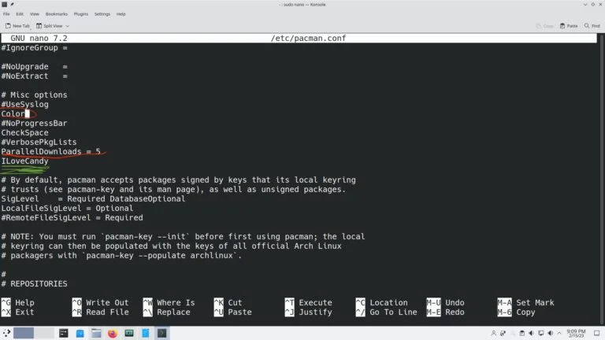

## Installation packages

`pacstrap -K /mnt base base-devel linux linux-firmware vi neovim networkmanager lvm2 grub git`

## Package manager

`/etc/pacman.conf`


### Reflector
`sudo pacman -S reflector`

`sudo cp /etc/pacman.d/mirrorlist /etc/pacman.d/mirrorlist.bak`

`reflector --verbose --latest 20 --protocol http,https --sort rate --save /etc/pacman.d/mirrorlist`

### Paru
`git clone https://aur.archlinux.org/paru.git ~/repos/paru && cd ~/repos/paru`

`makepkg -si`

## Xfce
`sudo pacman -S xfce4 xfce4-goodies`

## Qtile
`git clone https://github.com/decode390/arch-config/ ~/config`

`sudo pacman -S qtile picom`

`sudo pacman -S python-psutil`

`ln -s ~/config/.config/qtile ~/.config/qtile`

`ln -s ~/config/.config/picom ~/.config/picom`

## Window manager
`sudo pacman -S ly`

`sudo systemctl enable ly`

`sudo systemctl start ly`

## Alacritty
`sudo pacman -S alacritty`

`ln -s ~/config/.config/alacritty ~/.config/alacritty`

## Sound

`sudo pacman -S alsa alsa-utils pulseaudio pavucontrol volumeicon`

## Bluetooth

`sudo pacman -S bluez bluez-utils blueman`

`sudo sytemctl enable bluetooth`

`sudo sytemctl start bluetooth`

## Lock screen
`paru -S xidlehook`

`git clone https://git.suckless.org/slock ~/repos/slock`

`~/repos/slock/config.def.h`
```
/* user and group to drop privileges to */
static const char *user  = "decode380";
static const char *group = "decode380";

static const char *colorname[NUMCOLS] = {
        [INIT] =   "#1a1b26",     /* after initialization */
        [INPUT] =  "#444b6a",   /* during input */
        [FAILED] = "#f7769e",   /* wrong password */
};

/* treat a cleared input like a wrong password (color) */
static const int failonclear = 1;

```
`sudo make install`

`sudo ln -s ~/config/suspend@.service /etc/systemd/system/suspend@.service`

`sudo systemctl enable --now suspend@decode380.service`


## Symbolic links

`ln -s ~/config/.config/alacritty ~/.config/alacritty`

`ln -s ~/config/.config/picom ~/.config/picom`

`ln -s ~/config/.config/rofi ~/.config/rofi`

`ln -s ~/config/.config/qtile ~/.config/qtile`

`ln -s ~/config/.zshrc ~/.zshrc`

`sudo ln -s ~/config/suspend@.service /etc/systemd/system/suspend@.service`